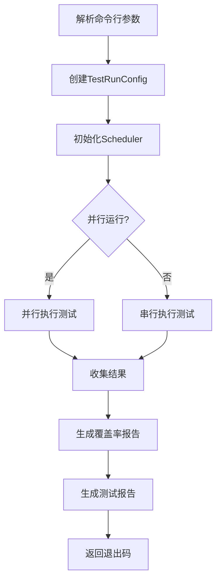

# Occop.TestRunner

Occop项目的自动化测试运行器和调度系统。

## 功能特性

### 核心功能

- ✅ **统一测试管理**: 集中管理所有类型的测试
- ✅ **智能调度**: 根据优先级和依赖关系调度测试
- ✅ **并行执行**: 支持多线程并行运行测试
- ✅ **覆盖率收集**: 自动收集和生成覆盖率报告
- ✅ **多格式报告**: 生成Text/Markdown/HTML/JSON格式报告
- ✅ **CI/CD集成**: 完美集成GitHub Actions等CI工具

### 支持的测试类型

| 测试类型 | 说明 | 运行频率 |
|---------|------|----------|
| Unit | 单元测试 | 每次提交 |
| Integration | 集成测试 | 每次提交 |
| Performance | 性能测试 | 每次提交 |
| Security | 安全测试 | 每次提交 |
| Stability | 稳定性测试 | 每日/按需 |

## 快速开始

### 安装

```bash
# 克隆项目
git clone https://github.com/your-org/occop.git
cd occop

# 恢复依赖
dotnet restore tests/Occop.TestRunner/Occop.TestRunner.csproj
```

### 基本用法

```bash
# 运行所有测试
dotnet run --project tests/Occop.TestRunner

# 运行特定类型的测试
dotnet run --project tests/Occop.TestRunner -- --types Unit,Integration

# 显示帮助
dotnet run --project tests/Occop.TestRunner -- --help
```

## 命令行参数

### 完整参数列表

| 参数 | 简写 | 类型 | 默认值 | 说明 |
|------|------|------|--------|------|
| --types | -t | string | All | 要运行的测试类型 |
| --parallel | -p | bool | true | 是否并行运行 |
| --max-parallelism | -mp | int | CPU核心数 | 最大并行度 |
| --timeout | -to | int | 3600 | 超时时间(秒) |
| --coverage | -c | bool | true | 是否生成覆盖率 |
| --filter | -f | string | - | 测试过滤器 |
| --output | -o | string | TestResults | 输出目录 |
| --verbosity | -v | string | normal | 详细级别 |
| --fail-fast | -ff | flag | false | 快速失败 |
| --help | -h | flag | - | 显示帮助 |

### 测试类型

可用的测试类型值:
- `Unit` - 单元测试
- `Integration` - 集成测试
- `Performance` - 性能测试
- `Security` - 安全测试
- `Stability` - 稳定性测试
- `All` - 所有测试(默认)

多个类型用逗号分隔: `--types Unit,Integration,Security`

### 详细级别

可用的详细级别:
- `quiet` - 最小输出
- `minimal` - 基本输出
- `normal` - 正常输出(默认)
- `detailed` - 详细输出
- `diagnostic` - 诊断级别输出

## 使用示例

### 基本示例

```bash
# 运行所有测试(默认)
dotnet run --project tests/Occop.TestRunner

# 仅运行单元测试
dotnet run --project tests/Occop.TestRunner -- --types Unit

# 运行安全和集成测试
dotnet run --project tests/Occop.TestRunner -- --types Security,Integration
```

### 性能优化

```bash
# 使用4个线程并行运行
dotnet run --project tests/Occop.TestRunner -- --max-parallelism 4

# 串行运行(禁用并行)
dotnet run --project tests/Occop.TestRunner -- --parallel false

# 快速失败(遇到第一个失败立即停止)
dotnet run --project tests/Occop.TestRunner -- --fail-fast
```

### 覆盖率控制

```bash
# 禁用覆盖率收集(加快速度)
dotnet run --project tests/Occop.TestRunner -- --coverage false

# 启用覆盖率并指定输出目录
dotnet run --project tests/Occop.TestRunner -- --coverage true --output ./CoverageReports
```

### 测试过滤

```bash
# 运行特定名称的测试
dotnet run --project tests/Occop.TestRunner -- --filter "FullyQualifiedName~SecurityManager"

# 运行特定类别的测试
dotnet run --project tests/Occop.TestRunner -- --filter "Category=Critical"

# 运行特定Trait的测试
dotnet run --project tests/Occop.TestRunner -- --types Security --filter "Priority=High"
```

### 调试和诊断

```bash
# 详细输出
dotnet run --project tests/Occop.TestRunner -- --verbosity detailed

# 诊断级别输出
dotnet run --project tests/Occop.TestRunner -- --verbosity diagnostic

# 自定义输出目录
dotnet run --project tests/Occop.TestRunner -- --output ./MyTestResults
```

## 报告

### 生成的报告

测试运行器会自动生成以下报告到`{OutputDirectory}/Reports`目录:

1. **TestReport.txt** - 纯文本格式摘要
2. **TestReport.md** - Markdown格式(适合GitHub)
3. **TestReport.html** - 交互式HTML报告
4. **TestReport.json** - 机器可读JSON格式

### 覆盖率报告

当启用覆盖率收集时,会在`{OutputDirectory}/{TestType}_Coverage`目录生成:

- **index.html** - HTML覆盖率报告
- **coverage.cobertura.xml** - Cobertura格式(CI集成)

### 示例报告

#### 文本报告示例

```
===============================================
           OCCOP 测试运行报告
===============================================

生成时间: 2025-10-03 12:00:00

总体摘要:
  测试总数: 156
  通过: 154 (98.72%)
  失败: 2 (1.28%)
  跳过: 0 (0.00%)
  总耗时: 00:05:23
  整体状态: ✗ 失败

各类测试详情:
-----------------------------------------------

[Integration]
  状态: ✓ Completed
  测试数: 36
  通过: 36
  失败: 0
  跳过: 0
  耗时: 02:15.345
  覆盖率: 87.50%

[Security]
  状态: ✓ Completed
  测试数: 108
  通过: 108
  失败: 0
  跳过: 0
  耗时: 01:45.123
  覆盖率: 92.30%
```

## 架构设计

### 组件结构

```
Occop.TestRunner/
├── Program.cs              # 主程序入口
├── Scheduler.cs            # 测试调度器
├── TestTypes.cs            # 测试类型和配置
└── Reports/
    └── TestReportGenerator.cs  # 报告生成器
```

### 核心类

#### Scheduler

负责测试的调度和执行。

主要方法:
- `RunAllTestsAsync()` - 运行所有配置的测试
- `IsAllTestsPassed()` - 检查所有测试是否通过

#### TestReportGenerator

负责生成各种格式的测试报告。

支持的格式:
- Text
- Markdown
- HTML
- JSON

### 工作流程



## 配置

### 代码配置

除了命令行参数,也可以通过代码配置:

```csharp
var config = new TestRunConfig
{
    TestTypes = TestType.Unit | TestType.Integration,
    RunInParallel = true,
    MaxParallelism = 4,
    TimeoutSeconds = 1800,
    GenerateCoverageReport = true,
    CoverageReportFormats = new[] { "Html", "Cobertura" },
    FailFast = false,
    Filter = "Category=Critical",
    OutputDirectory = "TestResults",
    Verbosity = "normal",
    CollectDiagnostics = false
};

var scheduler = new Scheduler(logger, config);
var results = await scheduler.RunAllTestsAsync();
```

## CI/CD集成

### GitHub Actions

```yaml
- name: Run Tests
  run: |
    dotnet run --project tests/Occop.TestRunner -- \
      --types All \
      --verbosity normal \
      --output ./TestResults

- name: Upload Test Results
  uses: actions/upload-artifact@v4
  with:
    name: test-results
    path: TestResults/Reports/
```

### GitLab CI

```yaml
test:
  script:
    - dotnet run --project tests/Occop.TestRunner -- --types All
  artifacts:
    paths:
      - TestResults/
    reports:
      coverage_report:
        coverage_format: cobertura
        path: TestResults/**/coverage.cobertura.xml
```

### Azure Pipelines

```yaml
- task: DotNetCoreCLI@2
  displayName: 'Run Tests'
  inputs:
    command: 'run'
    projects: 'tests/Occop.TestRunner/Occop.TestRunner.csproj'
    arguments: '-- --types All --output $(Build.ArtifactStagingDirectory)/TestResults'
```

## 性能考虑

### 优化建议

1. **使用并行执行**
   ```bash
   --parallel true --max-parallelism 8
   ```

2. **分离长时间运行的测试**
   ```bash
   # 快速测试
   --types Unit,Integration

   # 慢速测试(在夜间运行)
   --types Stability
   ```

3. **跳过不必要的覆盖率收集**
   ```bash
   --coverage false  # 开发环境
   ```

4. **使用测试过滤器**
   ```bash
   --filter "Category!=Slow"
   ```

### 性能指标

典型运行时间(在4核8GB机器上):

| 测试类型 | 测试数 | 串行耗时 | 并行耗时(4核) |
|---------|-------|---------|--------------|
| Unit | ~50 | ~30秒 | ~10秒 |
| Integration | ~36 | ~2分钟 | ~45秒 |
| Security | ~108 | ~3分钟 | ~1分钟 |
| Performance | ~20 | ~5分钟 | ~2分钟 |
| **总计** | ~214 | ~10分钟 | ~4分钟 |

## 故障排查

### 常见问题

#### 1. 测试项目未找到

**错误**: `未找到 {TestType} 测试项目，跳过`

**原因**: 测试项目路径不正确或项目不存在

**解决方案**:
```bash
# 检查项目是否存在
ls tests/Occop.IntegrationTests/Occop.IntegrationTests.csproj

# 确保项目已构建
dotnet build tests/Occop.IntegrationTests/Occop.IntegrationTests.csproj
```

#### 2. 覆盖率报告生成失败

**错误**: `覆盖率报告生成失败`

**原因**: ReportGenerator工具未安装

**解决方案**:
```bash
dotnet tool install --global dotnet-reportgenerator-globaltool
```

#### 3. 并行执行冲突

**错误**: 资源访问冲突

**解决方案**:
```bash
# 串行运行
--parallel false

# 或减少并行度
--max-parallelism 2
```

#### 4. 超时

**错误**: 测试超时

**解决方案**:
```bash
# 增加超时时间(秒)
--timeout 7200  # 2小时
```

### 调试技巧

```bash
# 1. 启用详细输出
--verbosity detailed

# 2. 收集诊断信息
--collect-diagnostics true

# 3. 运行特定测试
--filter "FullyQualifiedName=Occop.Tests.MyTest"

# 4. 快速失败定位问题
--fail-fast
```

## 扩展和自定义

### 添加新的测试类型

1. 在`TestTypes.cs`中添加新类型:
```csharp
public enum TestType
{
    // ...
    MyNewTestType = 1 << 5
}
```

2. 在`Scheduler.cs`的`GetTestProjectPath`中添加映射:
```csharp
return testType switch
{
    // ...
    TestType.MyNewTestType => Path.Combine(testsDir, "Occop.MyNewTests", "Occop.MyNewTests.csproj"),
    _ => null
};
```

### 自定义报告格式

实现`TestReportGenerator`的新格式方法:

```csharp
private string GenerateMyCustomFormat(Dictionary<TestType, TestRunResult> results)
{
    // 自定义报告逻辑
    return customReport;
}
```

## 最佳实践

1. **在开发时使用快速反馈**
   ```bash
   --types Unit --coverage false
   ```

2. **在PR前运行完整测试**
   ```bash
   --types All
   ```

3. **在CI中启用详细输出**
   ```bash
   --verbosity detailed
   ```

4. **定期运行稳定性测试**
   ```bash
   --types Stability  # 每日或每周
   ```

5. **监控测试性能**
   - 定期审查测试耗时
   - 优化慢速测试
   - 使用并行执行

## 相关文档

- [测试自动化指南](../../docs/testing/TESTING-GUIDE.md)
- [集成测试文档](../Occop.IntegrationTests/README.md)
- [性能测试文档](../Occop.PerformanceTests/README.md)
- [安全测试文档](../Occop.SecurityTests/README.md)

## 贡献

欢迎贡献!请:
1. Fork项目
2. 创建特性分支
3. 提交变更
4. 推送到分支
5. 创建Pull Request

## 许可证

本项目采用MIT许可证。

---

**版本**: 1.0.0
**最后更新**: 2025-10-03
